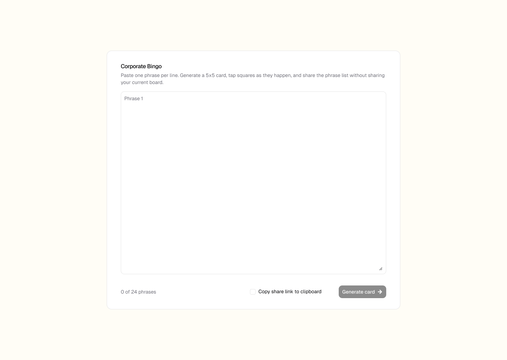
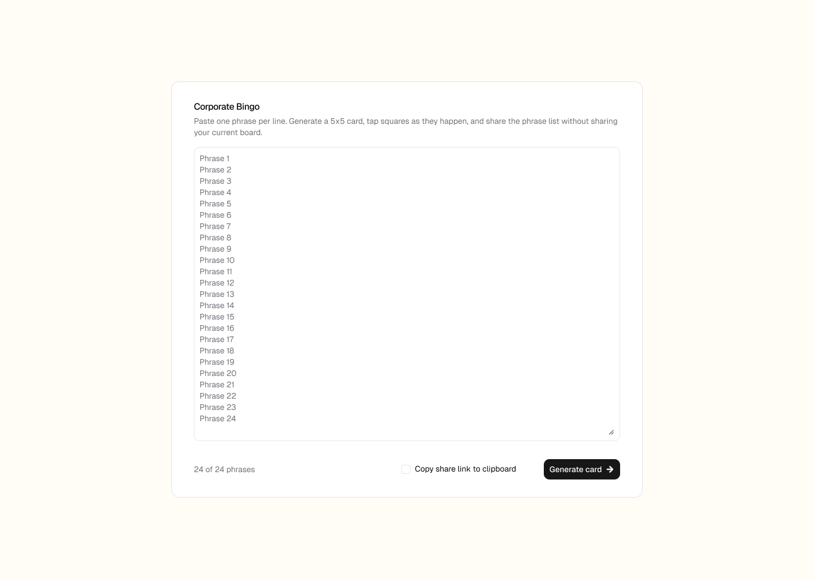
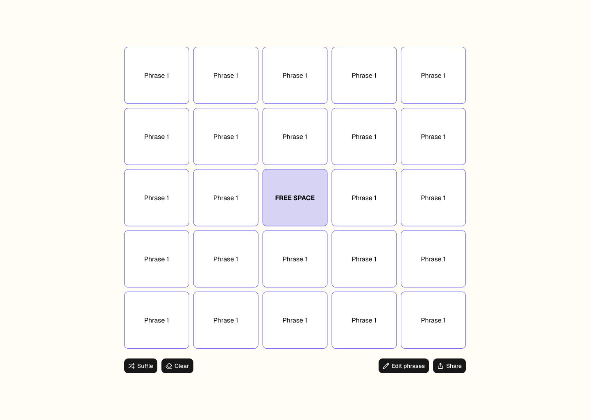
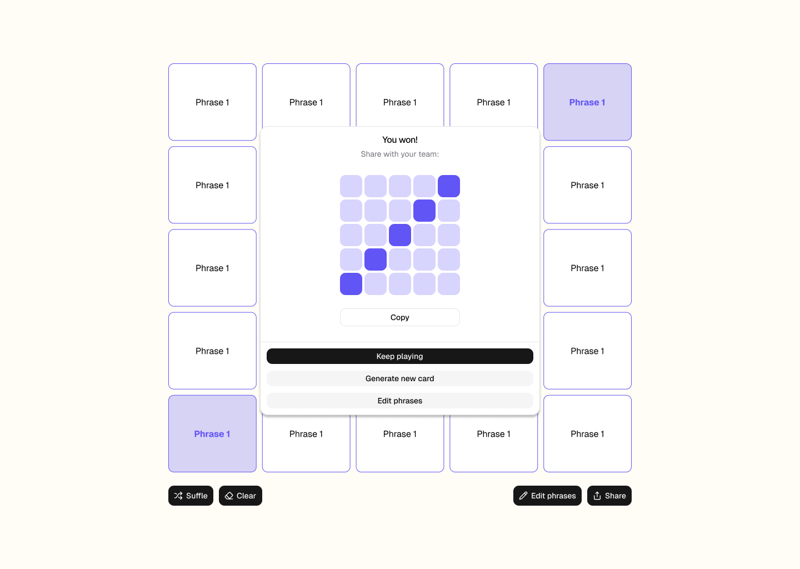

# Corporate Bingo

A browser-only React app for creating one playable 5x5 bingo card from a list of phrases.

## Screenshots

### Phrase entry

Paste one phrase per line, use the standard phrase set, or copy a phrase-share link while generating a card.





### Playable card

Mark squares as phrases come up, shuffle the board, clear marked squares, edit phrases, or share the phrase list.



### Win sharing

When a winning line is completed, copy a Wordle-style emoji result with a phrase-share link.



## Features

- Generate a randomized 5x5 bingo card from at least 24 unique phrases.
- Keep the center `FREE` square marked by default.
- Mark and clear squares during play.
- Copy share links that preserve phrases without sharing card order or marked state.
- Copy a Wordle-style result from the win popup.
- Persist local phrase text, card order, and marked progress in browser storage.

## Run locally

```bash
npm install
npm run dev
```

Then open the local URL printed by Vite.

## Checks

```bash
npm test
npm run build
```

## Sharing

Share links store the normalized phrase list in the URL hash. They do not include the current card order or marked squares, so each recipient gets a fresh randomized card.
